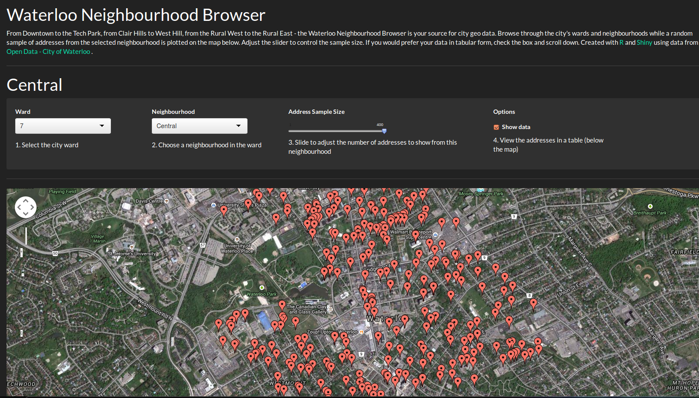

## Waterloo Neighbourhood Browser

Welcome to Waterloo, ON!
* View local city geo data. 
* Browse through the city's wards and neighbourhoods 
* See a random sample of addresses plotted on the map
* Adjust the slider to control the sample size. 
* Get tabular data checking the box.



--- .class #id 

## Open Data

Our application uses the AddressPoints dataset from the [City of Waterloo](http://www.waterloo.ca/en/opendata) (Contains information provided by the City of Waterloo under licence).


### Neighbourhoods

```r
head(unique(as.character(addresses$DISTRICT)))
```

```
## [1] "Lakeshore North" "Beechwood"       "Lakeshore"       "Central"        
## [5] "Eastbridge"      "Lexington"
```

### Geographic data

```r
head(addresses[1:3, 3:7])
```

```
##         STREET_NM WARD        DISTRICT LATITUDE LONGITUDE
## 1    NORTHLAKE DR    3 Lakeshore North 43.49750 -80.55109
## 2     OLD POST RD    6       Beechwood 43.46723 -80.55597
## 3 HUNTINGDON CRES    3       Lakeshore 43.49245 -80.55677
```

--- .class

## Random Sample of Addresses

A random sample of addresses in the selected neighbourhood are taken based on user input. Notice how the neighbourhood's boundaries are very clear even with a small sample size (above a certain point).


```r
    input.district <- 'Beechwood' # user inputs
    input.samplesize <- 400 

    neighbourhood <- addresses[addresses$DISTRICT == input.district,] # filter neighbourhood
    population <- nrow(neighbourhood)

    sample.indexes <- sample(1:population, input.samplesize) # random sample
    neighbourhood <- neighbourhood[sample.indexes, ] # filter sample
```
### Sampling 400 of 2770 addresses in the neighbourhood

--- .class

## R and Shiny  
<br/>
<div>
Made with R and <span style="font-face:Source Sans Pro;">Shiny</span> and RStudio and Git and Google and Caffo and Peng and all the package makers. Kerbam!
</div>

### Check it out: [Waterloo Neighbourhood Browser](https://jeremyshantz.shinyapps.io/waterloo/)
### Created for the Johns Hopkins [Developing Data Products course](https://www.coursera.org/course/devdataprod) on Coursera.


 
